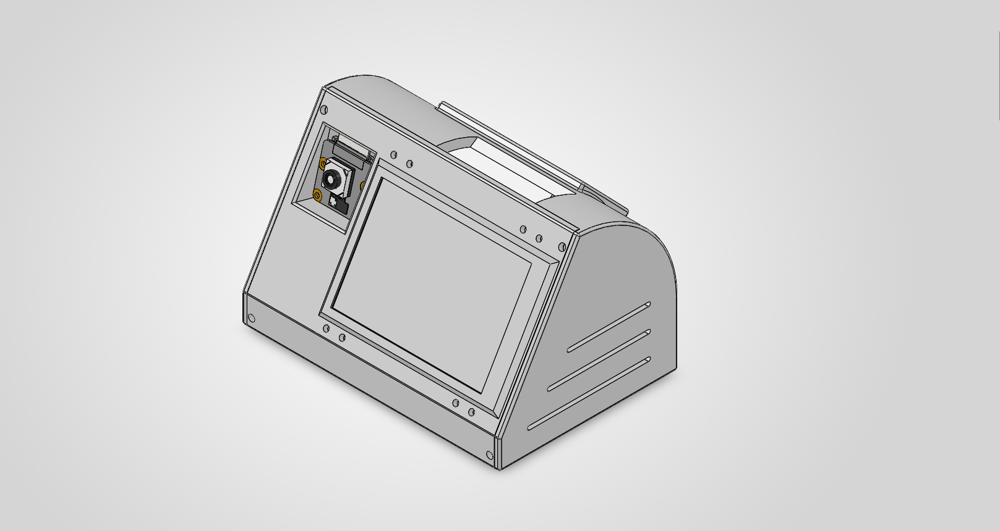
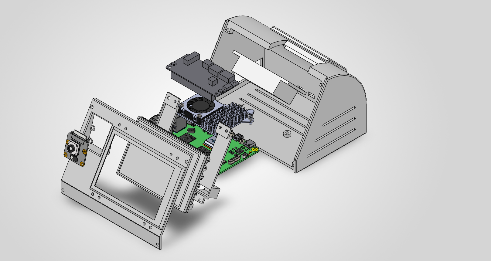

# Hermes Pi

A persistent physical AI assistant on a Raspberry Pi 5 — it **sees, hears and
speaks**, and shows you what it is doing on a small panel.

[Hermes Agent](https://hermes-agent.nousresearch.com/) (Nous Research) is the
assistant runtime. This repo is everything *around* it: the display renderer,
the camera and microphone services, the integration that feeds it real agent
state, and the units that keep it alive unattended. Nothing here forks or
patches Hermes — integration is through its documented extension points.

```
Discord ─┐                                    ┌─► HDMI panel (live agent state)
         ├─► Hermes Agent ─── plugins ────────┼─► camera  (it can look)
voice  ──┘   (ChatGPT sub)                    ├─► speaker (it answers aloud)
                                              └─► Gmail / Calendar (read-only)
camera ──► hand tracking ──► gesture edges ──────► your laptop (media keys)
```

## What it actually does

- **Reached over Discord** from any device, restricted to an explicit allowlist
- **Answers out loud.** Say "hey jarvis", ask a question, hear the answer —
  wake word, speech-to-text and speech synthesis all run **locally on the Pi**
- **Sees.** Ask what it can see and it looks through the camera and answers
  from the actual pixels
- **Reads your mail and calendar**, read-only, enforced by OAuth scope
- **Hand gestures** drive media keys on a Windows laptop over the LAN
- **A panel that never lies** about what the agent is doing

Inference runs on a **ChatGPT subscription** — no API key, nothing billed.

## The one rule

**The panel never invents state.** Every pixel traces to a real Hermes event or
to something the renderer observed itself. When the state file and the system
disagree, observation wins — `state.json` is an assertion by a process that may
be dead; `systemctl is-active` is a fact.

That rule generalises through the whole project, and most of the interesting
bugs in `docs/` are cases where something asserted a thing it had not checked.

## The enclosure

Designed in CAD around the parts rather than the other way round: the panel sets
the front face angle, the Pi's cooler sets the internal height, and the camera
sits in its own aperture above the bezel so it looks at the room rather than the
ceiling.

| Assembled | Exploded |
|---|---|
|  |  |

The stack, front to back: camera module and bezel, the 480×320 panel, the Pi 5
with its active cooler, the ReSpeaker HAT sitting over the GPIO header, and a
vented rear shell. The wedge is load-bearing in two senses — it puts the panel
at a readable angle on a desk, and the volume behind it is what makes room for
the cooler that keeps this at 60 °C under continuous vision work.

https://github.com/user-attachments/assets/dde94b69-73c5-4651-8de8-bedb814e6f65

## Hardware

| | |
|---|---|
| Host | Raspberry Pi 5, Debian 13 (trixie), aarch64, 8 GB |
| Panel | Waveshare 3.5" HDMI LCD — **physically 480×320**, driven at **800×480** (see below) |
| Camera | Camera Module 3 (imx708), via `picamera2` |
| Audio | ReSpeaker 2-Mic Pi HAT (WM8960) — two mics and a speaker |

**About the resolution, because it looks contradictory and is not.** The panel
is physically 480×320. HDMI *cannot carry* that: 480×320@60 needs an 11.6 MHz
pixel clock and the HDMI minimum is 25 MHz, so the driver rejects it outright.
640×480 is also too low at 23.2 MHz. **800×480 (29 MHz) is the smallest mode
that can physically be transmitted**, so that is what is sent, and the panel's
own scaler fits it to its 480×320 glass. The renderer pre-compensates for that
non-square scaling so circles come out round.

## Layout

| Path | Contents |
|---|---|
| `display/` | Framebuffer renderer. `panel.py` is the only hardware-specific file. |
| `camera/` | Sensor owner: capture, MJPEG stream, hand tracking, gesture edges. |
| `voice/` | Microphone owner: wake word, transcription, speech. |
| `hermes_ext/` | Plugins installed *into* `~/.hermes/` — display, camera, voice, Google, laptop. |
| `clients/windows/` | Gesture client for a Windows laptop. Stdlib only. |
| `tools/` | Animation generation, gesture training, voice auditioning, calibration. |
| `scripts/` | Install and setup, and the console escape hatch. |
| `tests/` | 11 modules, each runnable as plain `python3`. |
| `docs/` | Architecture, runbook, security, and the measurements behind each choice. |

## Getting out of it

The panel takes the whole screen and there is no login prompt behind it, which
is a problem the first time the network drops. Two escape hatches, both
**entirely local** — neither needs the agent or the internet, because the
situation they exist for is precisely that those are gone:

- Say **"hey jarvis"**, then **"open terminal"** as a complete sentence
- Or **hold the button on the HAT for three seconds**

Both put a login prompt on the screen. "close terminal" or another long hold
brings the panel back. See `docs/RUNBOOK.md`.

## Docs

| | |
|---|---|
| `docs/ARCHITECTURE.md` | the shape, and why |
| `docs/RUNBOOK.md` | operating and repairing it |
| `docs/SECURITY.md` | threat model, stated honestly |
| `docs/HARDWARE.md` | measured facts the design rests on |
| `docs/CAMERA.md` · `GESTURES.md` · `VOICE.md` · `GOOGLE.md` | per-subsystem |
| `docs/DECISIONS.md` · `DEFERRED.md` | why, and what is knowingly not done |

`CLAUDE.md` carries the traps — the mistakes already made here, with the
measurements that exposed them. It is the most useful file in the repo.

## Secrets

None are in this repo, and `.gitignore` covers them by name: Discord bot token,
ChatGPT OAuth, Google OAuth, the camera stream token, and the webhook HMAC
secret all live under `~/.hermes/` or `~/.config/hermes-pi/`, mode `0600`.

## Status

Working and in daily use. Built in phases; every performance number in the docs
came from a measurement on this machine, not an estimate.
